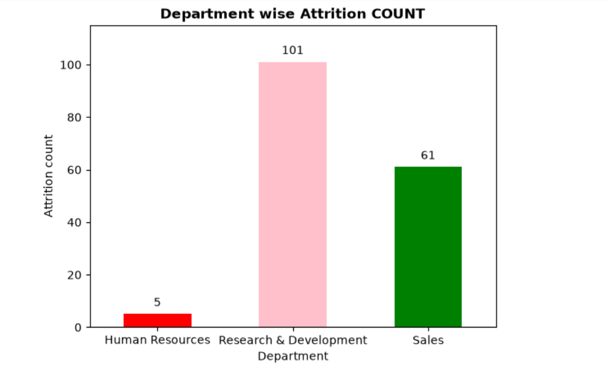
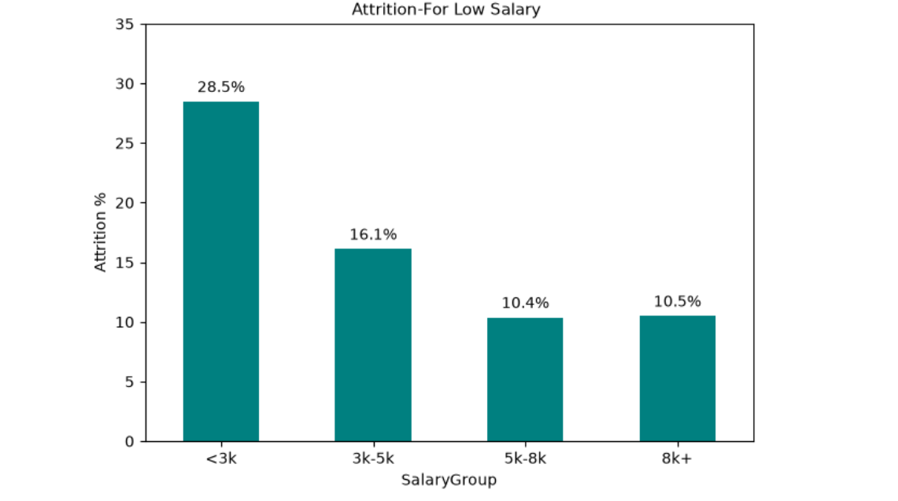
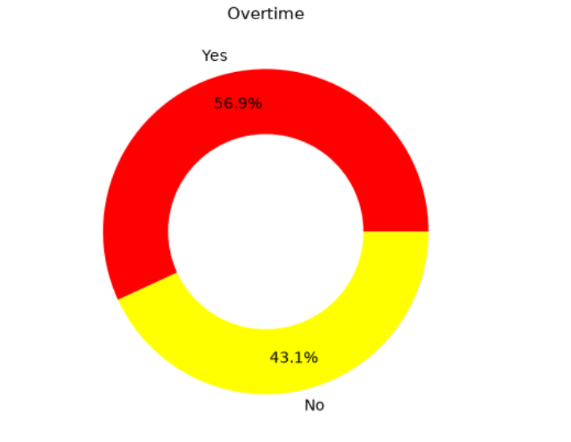
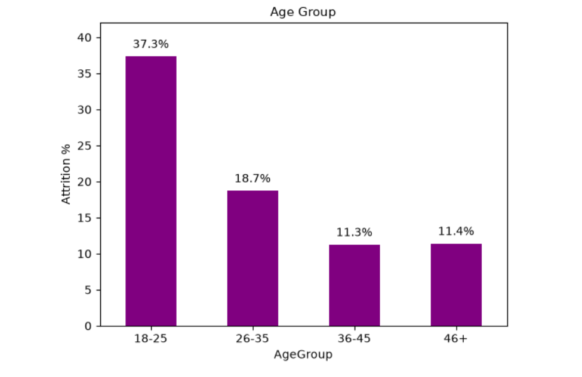

# HR Employee Attrition Analysis & Prediction

📌 *Problem Statement*
Employee attrition costs companies 50-200% of annual salary. This project analyzes 1470 employees to find WHY they leave.

🔍 *Key Findings*
- *16.12% Attrition Rate* (237 out of 1470)
- *Sales Dept* - Highest attrition 20.6%
- *Overtime = Main Reason* - 3X more likely to quit
- *Age 25-35* - Most attrition

📊 *Dashboard Preview*

🛠️ *Tech Stack*
Power BI | Python | Pandas | Machine Learning | DAX

📁 *Files*
- HR_Attrition_Dashboard.pbix - Power BI File
- HR EMPLOYEE ATTRITION.ipynb - Python Code
